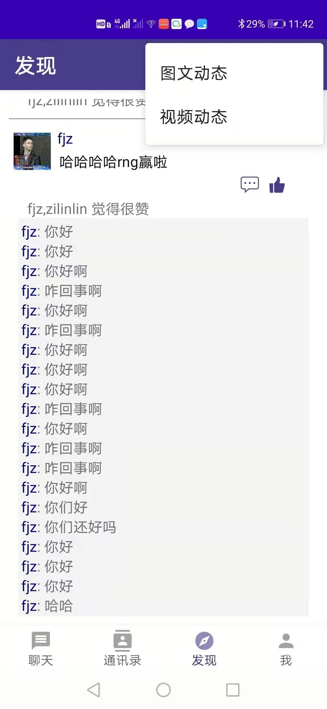

操作指南
======

注册登录
------
登录
++++++
输入用户名以及密码，点击登录按钮即可登录。如果没有账号，点击注册一个开始注册。

（为了方便测试，已有的用户信息“邮箱：szl; 密码：szl”）

.. image:: ../images/登录.png

注册
++++++
输入用户名以及密码，并点击添加头像按钮设置自己的头像。之后点击 **注册** 按钮则注册成功。

.. image:: ../images/注册.png

主页面&修改个人信息
------
主页面
++++++
主页面主要有四个部分， **聊天** **通讯录** **发现（动态）** **我**

在 **我** 页面中可以进行资料的设置和个人信息的查看修改

修改个人信息
++++++
点击进入 **我** 界面，点击 **资料设置** 按钮

.. image:: ../images/我.png

可以分别点击 **头像** **昵称** **用户ID** **密码** **个性签名** 进行修改

.. image:: ../images/修改信息.png

添加好友
------
点击 **通讯录** ，点击右上角，有 **建立群聊** **显示好友申请** **搜索用户** 三个选项。
我们点击搜索用户。

.. image:: ../images/通讯录.png

搜索用户结果出来之后，点击 **发送好友申请** ， 对方将接收到你的好友申请。

.. image:: ../images/添加好友.png

对方用户可以通过点击 **显示好友申请** 来进入收到的好友申请界面，点击接受或者拒绝进行操作。

.. image:: ../images/接受申请.png

删除好友
++++++
点击通讯录中的好友，可以看到他的个人信息。点击删除好友即可把好友删除。

.. image:: ../images/删除好友.png

发送消息
------
进入消息界面
++++++
点击通讯录中的好友，可以看到他的个人信息。点击发送消息可以进入和好友的消息界面。
或者，点击 **聊天** ，进入所有的聊天页面，选择一个聊天点击进入。

.. image:: ../images/聊天.jpg

进入聊天页面之后就可以看到页面排版，在底部有 **文字** **图片** **视频** **音频** **位置** 几种消息选项。
直接点击相应的消息选项即可发送相应消息。图片和视频都需要从手机的文件系统中进行选择。
直接点击位置选项可以将当前位置发送。

.. image:: ../images/页面.jpg

音频第一次点击为获取权限，第二次点击开始录音。

群聊
------
点击 **通讯录** 页面右上角 **建立群聊** 即可选择好友发起群聊。

点击需要选择的好友发起群聊。

发起群聊之后就可以在 **聊天** 界面中找到群聊。

点击右上角，有查看群聊功能，退出群聊功能和邀请好友功能。

只有群主可以修改群名称。

.. image:: ../images/群聊2.jpg

下图为查看群成员功能的界面显示。

.. image:: ../images/群聊3.jpg

动态
------
查看动态
++++++
点击 **发现** 界面，可以查看好友发的动态，点赞和评论信息。

点击右上角，有 **图文动态** 和 **视频动态** 两个选项用来发布新的动态。

发布动态
++++++
点击 **视频动态** 之后直接从相册选择视频，点击 **图文动态** 之后从相册选择照片，照片可以是0~9张，
之后点击发送发布图文动态。

.. image:: ../images/动态2.jpg

点赞和评论
++++++
点击 **评论** 图标，编辑文字评论并发表。

点击 **点赞** 图标，显示点赞完成。再次点击则可以取消点赞。

.. image:: ../images/动态3.jpg

